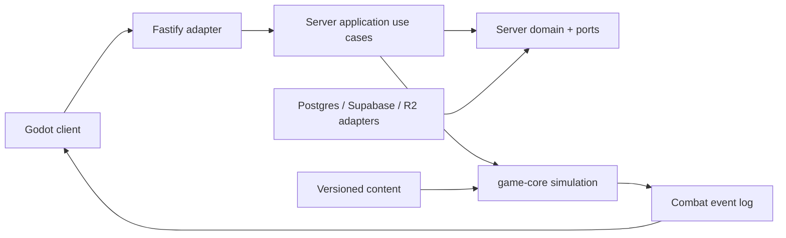

# Kiến trúc Alpha

**Trạng thái:** Khóa cho implementation — 2026-08-03

## Mục tiêu kiến trúc

- Combat có thể chạy headless, deterministic và không cần database hoặc mạng.
- API, database, Supabase và Godot là adapter ở rìa; không chứa luật game.
- Một command chỉ thay đổi state trong tenant của session xác thực.
- Content có version rõ ràng để run/replay cũ không đổi nghĩa sau balance patch.

## Bounded contexts

| Context | Sở hữu | Không sở hữu |
| --- | --- | --- |
| Combat | snapshot, tick, event, result, effect resolution | HTTP, database, client render |
| Run | trạng thái run, vòng, đội hình, inventory trong run | thuật toán damage |
| Economy | gold, reward, ledger và idempotency | kết quả combat chưa được xác thực |
| Identity & Tenancy | session, tenant, membership, authorization | player inventory mutation |
| Content | hero/item/trait/encounter version bất biến | state cụ thể của một run |
| Client presentation | input, UI, animation, audio và event playback | quyền quyết định combat/reward |

`Run` gọi Combat qua port nội bộ với snapshot đã khóa và nhận result/event log.
Economy chỉ nhận reward intent từ Run sau khi combat result đã xác thực. Identity
không được expose ORM user/entity cho context khác: chỉ đưa `actor_id` và
`tenant_id` đã xác minh.

## Cấu trúc workspace

```text
/client-godot
  /scenes              # scene và UI presentation
  /scripts             # input, API client, event playback
  /assets              # manifest/placeholder; asset nặng ở R2
/game-core
  /src/model           # value object, combat state, event type thuần TS
  /src/rules           # targeting, stat, damage, RNG, validation
  /src/simulation      # tick loop, effect executor, result resolver
  /src/content         # content type và compiler/validator
  /test                # unit, deterministic, golden replay tests
/server
  /src/domain          # run/economy entity và invariant ngoài combat
  /src/application     # command/query use case, transaction boundary
  /src/ports           # repository, auth, content, clock, event-log interface
  /src/adapters        # Fastify controller, PostgreSQL/Supabase adapter
  /src/infrastructure  # composition root, config, migration runner, worker
  /test                # use-case, adapter và integration tests
/content
  /heroes
  /items
  /traits
  /encounters
  /versions
/supabase
  /migrations
  /tests
/docs
```

Các folder được tạo khi bước dựng khung repository bắt đầu. Cây này là contract
về ownership, không phải lời mời tạo thêm package tùy tiện.

## Quy tắc dependency



- `game-core` chỉ import package TypeScript chuẩn và module nội bộ của nó. Nó
  không import `server`, Fastify, Supabase, ORM, filesystem hoặc Godot.
- `server/domain` chỉ import TypeScript chuẩn và shared types từ `game-core`.
- `server/application` được phép import domain, ports và `game-core`; không
  import adapter cụ thể.
- `server/adapters` implement ports và map HTTP/DB shape sang application DTO.
- `server/infrastructure` là composition root duy nhất được phép tạo adapter
  cụ thể và đọc environment variable.
- Godot không import hoặc sao chép simulation. Nó chỉ biết API DTO đã version.
- Content là dữ liệu; một content parser duy nhất chuyển nó sang type của
  `game-core`.

## Port bắt buộc

| Port | Trách nhiệm |
| --- | --- |
| `AuthContextPort` | lấy actor/tenant đã xác thực từ request |
| `RunRepository` | load, lock và persist run aggregate |
| `EconomyLedgerPort` | append mutation idempotent trong transaction |
| `ContentRepository` | load immutable content theo version |
| `CombatEventLogPort` | append/load event log có sequence ổn định |
| `UnitOfWork` | transaction cho mutation run + ledger + outbox |
| `ClockPort` | thời gian wall-clock ngoài simulation |
| `AssetManifestPort` | version asset tương thích với content |

Không port nào nhận `tenant_id` từ raw client payload. `tenant_id` luôn là thuộc
tính của `AuthContext` đã qua authentication và membership check.

## Aggregate và transaction

- `Run` là aggregate gốc cho prepare command, roster, inventory trong run,
  round state và snapshot reference.
- `EconomyLedger` là append-only; entry mang `tenant_id`, `run_id`, `reason`,
  delta, `idempotency_key` và correlation ID.
- `CombatSnapshot` là immutable value object. `CombatResult` không được mutate
  sau khi resolve.
- Mỗi command mutation lock đúng một run aggregate bằng transaction row lock.
  Reward, event outbox và run transition commit cùng transaction.
- Read model hoặc dashboard có thể eventual-consistent; combat result, run
  state và currency không được eventual-consistent.

## Bề mặt triển khai

- API container chạy Fastify và xử lý command/query ngắn.
- Worker dùng cùng application layer để chạy job có retry: simulation lớn,
  outbox delivery, replay verification và balance batch. Worker không có luật
  riêng.
- PostgreSQL/Supabase là system of record; R2 chỉ giữ binary asset/public
  manifest, không giữ authoritative game state.
- REST là giao thức Alpha. Realtime adapter là một rìa mới về sau, không làm
  thay đổi game core hoặc use case.

## Chiến lược test theo ranh giới

| Lớp | Test | Cần hạ tầng ngoài? |
| --- | --- | --- |
| game-core model/rules/simulation | unit, property, golden replay | Không |
| server domain/application | use case với in-memory port | Không |
| PostgreSQL/RLS/Fastify | integration và security test | Có |
| Godot | scene/input/event playback trên thiết bị | Có |

Một use case bị coi là sai kiến trúc nếu không thể test với in-memory ports.
Một combat test bị coi là sai kiến trúc nếu phải khởi chạy Fastify hoặc
PostgreSQL.
